# Snapshare

**A secret, then nothing.**

Share a password, API key, or token with a link that works once — or for a
lifetime you choose — and then stops working. The server never sees the
plaintext, and in passphrase mode it never sees the key either.

[](https://github.com/emverwell/snapshare/actions/workflows/ci.yml)
[](LICENSE)
[](https://github.com/emverwell/snapshare/actions/workflows/ci.yml)
[](https://github.com/googleapis/release-please)
[](.github/dependabot.yml)
[](Dockerfile)

[](https://nextjs.org)
[](tsconfig.json)
[](app/globals.css)
[](https://upstash.com)
[](https://snapshare-gamma.vercel.app)

**Live:** [snapshare-gamma.vercel.app](https://snapshare-gamma.vercel.app)

---

## How it works

Encryption and decryption both happen in the browser (Web Crypto,
AES-256-GCM). The server only ever stores and returns ciphertext — never a
key, never a passphrase, never the plaintext. See
[ADR 0001](docs/adr/0001-client-side-encryption.md) for why, and what that
trades away.

```mermaid
flowchart LR
    subgraph sender["Sender's browser"]
        A["Write a secret"] -->|"AES-256-GCM\nencrypt client-side"| B["ciphertext + IV\n(+ salt, passphrase mode)"]
    end

    B -->|"POST /api/secret\n(ciphertext only)"| C["Route handler\norigin check · rate limit · validation"]
    C -->|"SETEX secret:id  TTL"| D[("Upstash Redis")]

    D -->|"GET /api/secret/:id"| E["Route handler\nSec-Fetch-Site check · rate limit\nburns on read, if set"]
    E -->|"ciphertext + IV\n(+ salt)"| F["Recipient's browser"]

    subgraph recipient["Recipient's browser"]
        F -->|"decrypt with URL fragment key\nor a typed passphrase"| G["Plaintext, rendered\nnever sent anywhere"]
    end
```



Two key-delivery modes, chosen when the sender optionally sets a passphrase
— mutually exclusive, never combined:

| Mode | Key lives... | Server ever sees |
|---|---|---|
| **url-key** (default) | in the link's URL fragment (`#...`) — never sent over the network | ciphertext + IV only |
| **passphrase** | nowhere but the recipient's memory; derived via PBKDF2 (600k iterations) | ciphertext + IV + salt — never the passphrase |

## Features

- **Client-side AES-256-GCM encryption** — the plaintext never leaves the browser unencrypted
- **Two key-delivery modes** — a key in the URL fragment, or a passphrase that never travels with the link at all
- **Configurable lifetime** — 15 minutes, 1 hour, 6 hours, or 24 hours
- **Optional burn-after-reading** — the first successful read deletes the secret server-side
- **English / Spanish UI**, detected from the browser and switchable
- Origin + `Sec-Fetch-Site` checks, per-IP rate limiting, strict payload validation, and a hardened Content-Security-Policy — see the [OWASP hardening notes](#security) below

## Tech stack

Next.js 16 (App Router) · TypeScript · Tailwind CSS 4 · Upstash Redis + `@upstash/ratelimit` · Vitest · Docker · GitHub Actions · OpenTelemetry

## Getting started

```bash
npm install
npm run dev
```

Open [http://localhost:3000](http://localhost:3000). You'll need Upstash
Redis credentials in `.env.local` (`UPSTASH_REDIS_REST_URL`,
`UPSTASH_REDIS_REST_TOKEN`) — or skip that entirely and use Docker Compose
below, which runs a local Redis + REST shim for you.

### Running with Docker

```bash
docker compose up
```

Brings up the app, a local Redis, and a REST shim in front of it (Upstash's
client speaks REST, not the native Redis protocol — see
[ADR 0002](docs/adr/0002-docker-compose-not-kubernetes.md) for why this is
Compose and not Kubernetes). Add the observability stack (OpenTelemetry
Collector, Prometheus, Grafana) with:

```bash
docker compose --profile observability up
```

### Testing

```bash
npm test        # Vitest — crypto round-trips, payload validation, rate-limit/origin helpers
npm run lint
npx tsc --noEmit
```

## CI/CD

Every push runs lint → typecheck → test → Docker build → Trivy container
scan (pinned by commit SHA, not a tag — [a real supply-chain compromise](https://github.com/emverwell/snapshare/blob/main/.github/workflows/ci.yml)
hit this action's tags in the wild). All of it has to pass before `main` can
deploy — Vercel's own auto-deploy-on-push is disabled specifically so a
failing gate actually blocks production, not just shows red after the fact.
Releases are cut by [release-please](https://github.com/googleapis/release-please)
from commit messages: it keeps a standing release PR with the version bump
and changelog, and merging it creates the tag and GitHub Release; Dependabot
keeps npm, GitHub Actions, and both Docker surfaces current on a weekly
cycle.

## Security

This app went through a deliberate OWASP Top 10 pass, not just ad hoc
hardening:

- **A01 Broken Access Control** — the one-time-read endpoint rejects
  cross-site requests via `Sec-Fetch-Site` (a plain GET can burn a secret,
  so it needs the same scrutiny as a mutating request)
- **A02 Cryptographic Failures** — PBKDF2 at 600,000 iterations for
  passphrase mode; see [ADR 0001](docs/adr/0001-client-side-encryption.md)
  for why iteration count is the main lever here
- **A05 Security Misconfiguration** — CSP, `X-Content-Type-Options`,
  `X-Frame-Options`, `Referrer-Policy`, `Permissions-Policy`, and
  `Cache-Control: private, no-store` on every API response
- **A06 Vulnerable Components** — Trivy scans the container image on every
  push; Dependabot covers all four ecosystems in play
- **A09 Logging & Monitoring** — origin/cross-site rejections and rate-limit
  hits are logged for visibility into abuse patterns

## Architecture Decision Records

- [0001. Encrypt and decrypt client-side; the server never sees a key or plaintext](docs/adr/0001-client-side-encryption.md)
- [0002. docker-compose for local dev/self-host, not Kubernetes](docs/adr/0002-docker-compose-not-kubernetes.md)

## License

[MIT](LICENSE)
